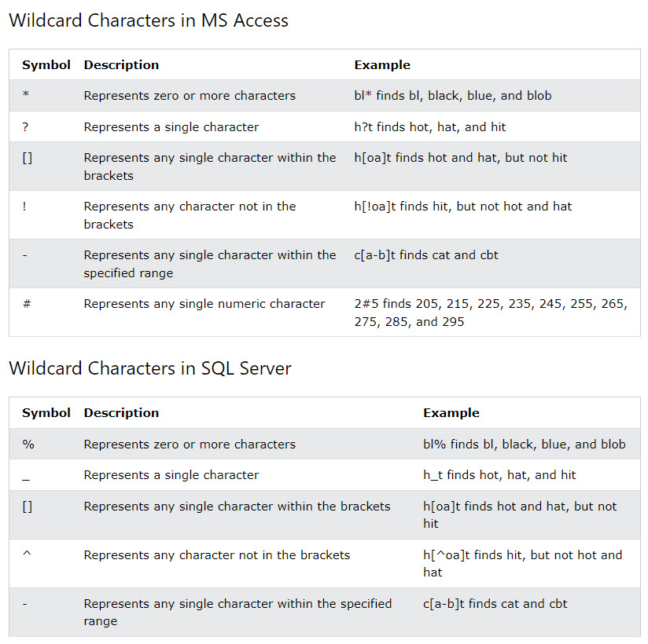
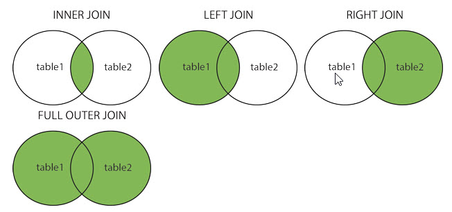

# SQL

- SQL is a standard language for storing, manipulating and retrieving data in databases.

```sql
SELECT * FROM Customers;
```

- Select all data from Customers db.

# Essentials

# 1. Intro

*What is SQL?*
- SQL is a standard language for accessing and manipulating databases.
- SQL stands for Structured Query Language
- SQL became a standard of the American National Standards Institute (ANSI) in 1986, and of the International Organization for Standardization (ISO) in 1987

*What can SQL do?*

- SQL can 
    - execute queries against a database
    - insert records in a database
    - update/delete records from a database
    - create new databases and tables.
    - set permissions on tables, procedures, and views.

*How do I use SQL on your website?*

- Use RDBMS database program such as MS Access, SQL Server, MySQL
- Use a server-side scripting such as PHP or ASP
- Use SQL to get the data you want. 
- Use HTML/CSS to style the page.

*What is RDBMS?*

- RDBMS stands for Relational Database Management System.
- RDBMS is the basis for SQL, for all modern database systems such as MS SQL server, IBM DB2, Oracle, MySQL, and Microsoft Access. 
- The data in RDBMS is stored in database objects called tables. A table is a collection of related data entries and it consists of columns and rows.

*How database is structured?*

- RDBMS > db objects > tables > fields 

- RDBMS: stands for Relational Database Management System. It is the basis for SQL, and for all modern database systems such as MS SQL Server, IBM DB2, Oracle, MySQL, and Microsoft Access.
*Tables:* 
- The data in RDBMS is stored in a database objects called tables.
- A colleciton of related data entries and its consists of columns and rows. 
*Fields*
- Fields are column headers such as CustomerID, CustomerName, ContactName, Address, City, PostalCode.
- a column in a table that is designed to maintain specific information about every record in the table. 
*Record*
- each individual entry that exists in a table.
*Column*
- a vertical entity in a table that contains all information asscoiated with a field. (exluding fields.)

# 2. Syntax

- A database most often contains one or more tables. Each table is identified by a name (e.g. "Customers" or "Orders"). Tables contain records (rows) with data.

*SQL keywords are NOT case sensitive: select is the same as SELECT*

List of most important SQL commands:
- SELECT - extracts data from a database
- UPDATE - updates data in a database
- DELETE - deletes data from a database
- INSERT INTO - inserts new data into a database
- CREATE DATABASE - creates a new database
- ALTER DATABASE - modifies a database
- CREATE TABLE - creates a new table
- ALTER TABLE - modifies a table
- DROP TABLE - deletes a table
- CREATE INDEX - creates an index (search key)
- DROP INDEX - deletes an index

# 3. Select

- The SELECT statement is used to select data from a database.

Format:
```SQL
SELECT column1, column2, ...
FROM table_name;
```

ex: select all 
```sql
-- Select all data from a table_name table
SELECT * FROM table_name;
```

# 4. Select Distinct

- The SELECT DISTINCT statement is used to return only distinct (different) values.

- It will only retrieve one column that you want to get.

ex 1: Get one column
```sql
-- select only country field from a table called Customers.
SELECT DISTINCT Country FROM Customers;
```

ex 2: Count one column
```sql
-- select only country field from a Customers table and count each row. 
SELECT COUNT(DISTINCT Country) FROM Customers;
```

ex 3: Count and show as a different name
```sql
-- count all data from Customers Table > Country and display field as DistinctCountries
SELECT Count(*) AS DistinctCountries
FROM (SELECT DISTINCT Country FROM Customers);
```

# 5. Where Clause

- The `WHERE` caluse is used to filter records. 

Format:
```sql
SELECT column1, column2, ...
FROM table_name
WHERE condition;
```
ex:
```sql
-- Select all data from Customers table where country value is 'Mexico'
SELECT * FROM Customers
WHERE Country='Mexico';
```

# 6. AND, OR and NOT Operators

- The WHERE clause can be combined with AND, OR, and NOT operators.
    - The AND and OR operators are used to filter records based on more than one condition:
    - The NOT operator displays a record if the condition(s) is NOT TRUE.

ex 1: AND 
```sql
SELECT * FROM Customers
WHERE Country='Germany' AND City='Berlin';
```

ex 2: OR
```sql
SELECT * FROM Customers
WHERE City='Berlin' OR City='München';
```

ex 3: NOT
```sql
SELECT * FROM Customers
WHERE NOT Country='Germany';
```

ex 4: Combinations

```sql
-- WHERE, AND, OR
SELECT * FROM Customers
WHERE Country='Germany' AND (City='Berlin' OR City='München');
-- WHERE NOT, AND NOT
SELECT * FROM Customers
WHERE NOT Country='Germany' AND NOT Country='USA';
```

# 7. Order By

- The ORDER BY keyword is used to sort the result-set in ascending or descending order.
- The ORDER BY keyword sorts the records in ascending order by default. To sort the records in descending order, use the DESC keyword.


Format:
```sql
SELECT column1, column2, ...
FROM table_name
ORDER BY column1, column2, ... ASC|DESC;
```

ex 1: ORDER BY
```sql
SELECT * FROM Customers
ORDER BY Country;
```

ex 2: ORDER BY DESC
```sql
-- Order by Country field in decreasing order.
SELECT * FROM Customers
ORDER BY Country DESC;
```

ex 3: Use multiple fields to order.
```sql
-- Order by Country field first and then order by CustomerName field.
SELECT * FROM Customers
ORDER BY Country, CustomerName;
```

- *Descending order is a reverse of ascending order which is revered alphabetical.*

# 8. Insert Into

- The INSERT INTO statement is used to insert new records in a table.

*How do you use INSERT INTO?*

- There are two ways to insert values.

1. Specify both the column names and the values to be inserted:
Format:
```sql
INSERT INTO table_name (column1, column2, column3, ...)
VALUES (value1, value2, value3, ...);
```

ex:
```sql
INSERT INTO Customers (CustomerName, ContactName, Address, City, PostalCode, Country)
VALUES ('Cardinal', 'Tom B. Erichsen', 'Skagen 21', 'Stavanger', '4006', 'Norway');
```

2. If you want to insert for all columns, you do not need to specify the fields.
Format:
```sql
INSERT INTO table_name
VALUES (value1, value2, value3, ...);
```
*This way is not recommended as you have to create the ID manually also.*

# 9. Null values

- A field with a NULL value is a field with no value.
- If a field in a table is optional, it is possible to insert a new record or update a record without adding a value to this field. Then, the field will be saved with a NULL value.

*How do you identify NULL values?*

- You can use IS NOT NULL OR IS NULL TO check whether the value is NULL or not.
```sql
-- Select data that is not null
SELECT column_names
FROM table_name
WHERE column_name IS NOT NULL;

-- Select data that is null
SELECT column_names
FROM table_name
WHERE column_name IS NULL;
```

# 10. Update

- The UPDATE statement is used to modify the existing records in a table.

*How do you update the existing records in the database?*

```sql
-- update Customers Table by setting Constact Name field into 'Alfred Schmidt' and City into 'Frankfurt' where CustomerID is 1.
UPDATE Customers
SET ContactName = 'Alfred Schmidt', City= 'Frankfurt'
WHERE CustomerID = 1;
```

*How do you update multiple records?*
- If you do not specify the unique ID, many records that meet the criteria will be updated.
```sql
-- update Customer Table by setting ALL ContactName into 'Juan' where Country is 'Mexico'.
UPDATE Customers
SET ContactName='Juan'
WHERE Country='Mexico';
```

*WARNING: Be careful when updating records. If you omit the WHERE clause, ALL records will be updated!*

# 11. Delete

- The DELETE statement is used to delete existing records in a table.

ex 1: Delete One record

```sql
-- Delete from Customer Table, a record where CustomerName is 'Alfreds Futterkiste'
DELETE FROM Customers WHERE CustomerName='Alfreds Futterkiste';
```

ex 2: Delete All Records
```sql
-- Delete all records from the table called table_name
DELETE FROM table_name;
```

# 12. Select Top

- The SELECT TOP clause is used to specify the number of records to return.
*The SELECT TOP clause is useful on large tables with thousands of records. Returning a large number of records can impact performance.*

1. SQL Server / MS Access Syntax:
```sql
SELECT TOP number|percent column_name(s)
FROM table_name
WHERE condition;
```
2. MySQL Syntax:
```sql
SELECT column_name(s)
FROM table_name
WHERE condition
LIMIT number;
```
3. Oracle 12 Syntax:
```sql
SELECT column_name(s)
FROM table_name
ORDER BY column_name(s)
FETCH FIRST number ROWS ONLY;
```

ex1: TOP, LIMIT and FETCH FIRST


```sql
--SQL server/MS Access:
SELECT TOP 3 * FROM Customers;

-- MySQL
SELECT * FROM Customers
LIMIT 3;

-- Oracle
SELECT * FROM Customers
FETCH FIRST 3 ROWS ONLY;
```

ex 2: TOP PERCENT

```sql
-- SQL Server/MS Access
SELECT TOP 50 PERCENT * FROM Customers;

-- Oracle
SELECT * FROM Customers
FETCH FIRST 50 PERCENT ROWS ONLY;
```

ex 3: ADD a WHERE CLAUSE

```sql
-- SQL
SELECT TOP 3 * FROM Customers
WHERE Country='Germany';

-- MySQL
```

# 13. SQL MIN() and MAX() Functions

*The SQL MIN() and MAX() Functions*
- The MIN() function returns the smallest value of the selected column.
- The MAX() function returns the largest value of the selected column.

ex 1: Select a minimum value from the column_name
```sql
SELECT MIN(Price) AS SmallestPrice
FROM Products;
```

ex 2: Select a maximum value from the column_name
```sql
SELECT MAX(Price) AS LargestPrice
FROM Products;
```

# 14. SQL COUNT(), AVG() and SUM() Functions


ex 1: Count() 
- The COUNT() function returns the number of rows that matches a specified criterion.
```sql
SELECT COUNT(ProductID)
FROM Products;
```

ex 2: Avg()
- The following SQL statement finds the average price of all products:

```sql
-- Use an SQL function to calculate the average price of all products.

SELECT AVG(Price)
FROM Products;
```

ex 3: Sum()
- The following SQL statement finds the sum of the "Quantity" fields in the "OrderDetails" table:

```sql
SELECT SUM(Quantity)
FROM OrderDetails;
```

# 15. Like

- The LIKE operator is used in a WHERE clause to search for a specified pattern in a column.

- There are two wildcards often used in conjunction with the LIKE operator:

    - The percent sign (%) represents zero, one, or multiple characters
    - The underscore sign (_) represents one, single character

ex 1: The following SQL statement selects all customers with a CustomerName starting with "a":

```sql
SELECT * FROM Customers
WHERE CustomerName LIKE 'a%';
```

ex 2: The following SQL statement selects all customers with a CustomerName ending with "a":

```sql
SELECT * FROM Customers
WHERE CustomerName LIKE '%a';
```

ex 3: Word Search


```sql
-- selects all customers with a CustomerName that have "or" in any position:
SELECT * FROM Customers
WHERE CustomerName LIKE '%or%';
```

ex 4: r in the second position.
```sql
-- selects all customers with a CustomerName that have "r" in the second position:
SELECT * FROM Customers
WHERE CustomerName LIKE '_r%';
```

EX 5: NOT LIKE

```sql
-- 
SELECT * FROM Customers
WHERE City NOT LIKE 'a%';

```

# 16. Wildcards

- A wildcard character is used to substitute one or more characters in a string.

- Wildcard characters are used with the LIKE operator. The LIKE operator is used in a WHERE clause to search for a specified pattern in a column.




## a. % Wildcard 
ex 1: the word that starts with "ber"
```sql
SELECT * FROM Customers
WHERE City LIKE 'ber%';
```

ex 2: the word that contains the patterh "%es%"
```sql
SELECT * FROM Customers
WHERE City LIKE '%es%';
```
## b. _ Wildcard

ex 1: select all customers with a City starting with an y character, followed by "ondon"
```sql
SELECT * FROM Customers
WHERE City LIKE '_ondon';
```

## c. [charlist] Wildcard

ex 1: 
```sql
SELECT * FROM Customers
WHERE City LIKE '_ondon';
```

ex 2:
```sql
SELECT * FROM Customers
WHERE City LIKE 'L_n_on';
```

## d. [!charlist] Wildcard

ex 1:
```sql
-- select all customers with a City NOT starting with "b", "s", or "p":
SELECT * FROM Customers
WHERE City LIKE '[!bsp]%';
```

ex 2:
```sql
-- select all customers with a City DOES start with "b", "s", or "p":
SELECT * FROM Customers
WHERE City NOT LIKE '[bsp]%';
```

# 17. IN

- The IN operator allows you to specify **multiple values in a WHERE** clause.
- The IN operator is a shorthand for multiple OR conditions.

ex 1: Select Customers from certain countries.
```sql
-- Select all data from customers table where Country column is 'Germany', 'France' or 'UK'
SELECT * FROM Customers
WHERE Country IN ('Germany', 'France', 'UK');
```

ex 2: NOT IN
```sql
-- Select all data form customers table where Country is NOT IN Germany, France or UK.
SELECT * FROM Customers
WHERE Country NOT IN ('Germany', 'France', 'UK');
```

ex 3: 
```sql
-- Select all data from Customers table where Country is in the same country as the people from suppliers table.
SELECT * FROM Customers
WHERE Country IN (SELECT Country FROM Suppliers);
```

ex 4:
```sql
-- Select all from Customers table where Country is not in Norway or France.
SELECT * FROM Customers
WHERE Country NOT IN ('Norway', 'France');
```

# 18. SQL BETWEEN Operator

- The BETWEEN operator selects values within a given range. The values can be numbers, text, or dates.
*The BETWEEN operator is inclusive: begin and end values are included.*

ex 1: BETWEEN
```sql
-- selects all products with a price between 10 and 20:
SELECT * FROM Products
WHERE Price BETWEEN 10 AND 20;
```

ex 2: NOT BETWEEN
```sql
-- select all products table with a price no in between 10 and 20.
SELECT * FROM Products
WHERE Price NOT BETWEEN 10 AND 20;
```
ex 3: Variation with BETWEEN

```sql
SELECT * FROM Products
WHERE Price BETWEEN 10 AND 20
AND CategoryID NOT IN (1,2,3);
```

ex 4: BETWEEN words
```sql
-- Between words (but mostly the between first characters)
SELECT * FROM Products
WHERE ProductName BETWEEN 'Carnarvon Tigers' AND 'Mozzarella di Giovanni'
ORDER BY ProductName;
```

ex 5: NOT BETWEEN words.
```sql
SELECT * FROM Products
WHERE ProductName NOT BETWEEN 'Carnarvon Tigers' AND 'Mozzarella di Giovanni'
ORDER BY ProductName;
```

ex 6: BETWEEN Dates

```sql
-- between two dates.
SELECT * FROM Orders
WHERE OrderDate BETWEEN #07/01/1996# AND #07/31/1996#;

SELECT * FROM Orders
WHERE OrderDate BETWEEN '1996-07-01' AND '1996-07-31';
```

# 19. Aliases

- SQL aliases are used to give a table, or a column in a table, a temporary name.
- Aliases are often used to make column names more readable.
- An alias only exists for the duration of that query.
- An alias is created with the AS keyword.

ex 1: Create Alias

```sql
-- Select CustomerID and CustomerName fields and name them as ID and Customer.
SELECT CustomerID AS ID, CustomerName AS Customer
FROM Customers;
```

ex 2: Two words Alias

```sql
SELECT CustomerName AS Customer, ContactName AS [Contact Person]
FROM Customers;
```

ex 3: Concatenate with + to create an Address
```sql
-- 
-- Add CustomerName and get (address+PostalCode+City+Country fields) as Address
SELECT CustomerName, Address + ', ' + PostalCode + ' ' + City + ', ' + Country AS Address
FROM Customers;
```

ex 4: Alias for Tables

```sql
-- Customer=c, Orders=o
SELECT o.OrderID, o.OrderDate, c.CustomerName
FROM Customers AS c, Orders AS o
WHERE c.CustomerName='Around the Horn' AND c.CustomerID=o.CustomerID;
```

# 20. Joins

- A JOIN clause is used to combine rows from two or more tables, based on a related column between them.

ex 1: Join "Order" and "Customers"
- In order to join two tables, they need to have a key such as CustomerID. 
- If they do have matching column, you can join them as below

```sql
-- Inner join: overlap.
SELECT Orders.OrderID, Customers.CustomerName, Orders.OrderDate
FROM Orders
INNER JOIN Customers ON Orders.CustomerID=Customers.CustomerID;
```

Different Types of SQL JOINs
*Here are the different types of the JOINs in SQL:*

- (INNER) JOIN: Returns records that have matching values in both tables
- LEFT (OUTER) JOIN: Returns all records from the left table, and the matched records from the right table
- RIGHT (OUTER) JOIN: Returns all records from the right table, and the matched records from the left table
- FULL (OUTER) JOIN: Returns all records when there is a match in either left or right table



# 21. INNER JOIN

- The INNER JOIN keyword selects records that have matching values in both tables.

ex 1: Between two tables
```sql
-- Select two columns called OrderID from Order table and CustomerName from a Customers table. From Orders table Inner join Orders and Customers tables by CustomerID.
SELECT Orders.OrderID, Customers.CustomerName
FROM Orders
INNER JOIN Customers ON Orders.CustomerID = Customers.CustomerID;
```

# 21. LEFT JOIN

- The LEFT JOIN keyword returns all records from the left table (table1), and the matching records from the right table (table2). The result is 0 records from the right side, if there is no match.

```sql
SELECT Customers.CustomerName, Orders.OrderID
FROM Customers
LEFT JOIN Orders ON Customers.CustomerID = Orders.CustomerID
-- It is important who is the left because everything on the left will be included.

ORDER BY Customers.CustomerName;
```

*Note: The LEFT JOIN keyword returns all records from the left table (Customers), even if there are no matches in the right table (Orders).*

# 22. RIGHT JOIN 

- The RIGHT JOIN keyword returns all records from the right table (table2), and the matching records from the left table (table1). The result is 0 records from the left side, if there is no match.

```sql
-- statement will return all employees, and any orders they might have placed:
SELECT Orders.OrderID, Employees.LastName, Employees.FirstName
FROM Orders
RIGHT JOIN Employees ON Orders.EmployeeID = Employees.EmployeeID
ORDER BY Orders.OrderID;
```

# 23. FULL OUTER JOIN
- The FULL OUTER JOIN keyword returns all records when there is a match in left (table1) or right (table2) table records.

```sql
SELECT Customers.CustomerName, Orders.OrderID
FROM Customers
FULL OUTER JOIN Orders ON Customers.CustomerID=Orders.CustomerID
ORDER BY Customers.CustomerName;
```
*Problem: some fields that do not correspond will have NULL values.*

# 24. Self Join

- A self join is a regular join, but the table is joined with itself.

```sql
-- 
-- Select A.CustomerName and B.CustomerNAme and A.City from Customers A and Customers B where CustomerID are same and City are same.
SELECT A.CustomerName AS CustomerName1, B.CustomerName AS CustomerName2, A.City
FROM Customers A, Customers B
WHERE A.CustomerID <> B.CustomerID
AND A.City = B.City
ORDER BY A.City;
```

# 25. UNION Operator

- The UNION operator is used to combine the result-set of two or more SELECT statements.
    - Every SELECT statement within UNION must have the same number of columns
    - The columns must also have similar data types
    - The columns in every SELECT statement must also be in the same order


ex 1: SQL UNION 
- The following SQL statement returns the cities (only distinct values) from both the "Customers" and the "Suppliers" table:

```sql
-- returns the cities (only distinct values) from both the "Customers" and the "Suppliers" table:
SELECT City FROM Customers
UNION
SELECT City FROM Suppliers
ORDER BY City;
```

ex 2: SQL UNION ALL 
- The following SQL statement returns the cities (duplicate values also) from both the "Customers" and the "Suppliers" table:
```sql
SELECT City FROM Customers
UNION ALL
SELECT City FROM Suppliers
ORDER BY City;
```

# 26. GROUP BY

- The GROUP BY statement groups rows that have the same values into summary rows, like "find the number of customers in each country".

- The GROUP BY statement is often used with aggregate functions (COUNT(), MAX(), MIN(), SUM(), AVG()) to group the result-set by one or more columns.

- *Get the total count*

ex 1:
```sql
--  lists the number of customers in each country:
SELECT COUNT(CustomerID), Country
FROM Customers
GROUP BY Country;
```

ex 2: 
```sql
-- 
SELECT COUNT(CustomerID), Country
FROM Customers
GROUP BY Country
ORDER BY COUNT(CustomerID) DESC;
```

# 27. HAVING

- The HAVING clause was added to SQL because the WHERE keyword cannot be used with aggregate functions.

ex 1: HAVING CustomerID Greater Than 5
```sql
--  lists the number of customers in each country. Only include countries with more than 5 customers:
SELECT COUNT(CustomerID), Country
FROM Customers
GROUP BY Country
HAVING COUNT(CustomerID) > 5;
```

ex 2: More HAVING with a combination
```sql
SELECT Employees.LastName, COUNT(Orders.OrderID) AS NumberOfOrders
FROM (Orders
INNER JOIN Employees ON Orders.EmployeeID = Employees.EmployeeID)
GROUP BY LastName
HAVING COUNT(Orders.OrderID) > 10;
```

# 28. EXISTS

The SQL EXISTS Operator

- The EXISTS operator is used to test for the existence of any record in a subquery.
- The EXISTS operator returns TRUE if the subquery returns one or more records.

ex 1: Comparing two tables
```sql
SELECT SupplierName
FROM Suppliers
WHERE EXISTS (SELECT ProductName FROM Products WHERE Products.SupplierID = Suppliers.supplierID AND Price < 20);
```

ex 2:  TRUE and lists the suppliers with a product price equal to 22:
```sql
SELECT SupplierName
FROM Suppliers
WHERE EXISTS (SELECT ProductName FROM Products WHERE Products.SupplierID = Suppliers.supplierID AND Price = 22);
```

# 29. SQL ANY and ALL Operators

- The ANY and ALL operators allow you to perform a comparison between a single column value and a range of other values.

*The ANY operator:*

- returns a boolean value as a result
- returns TRUE if ANY of the subquery values meet the condition
- ANY means that the condition will be true if the operation is true for any of the values in the range.

ex 1:
```sql
-- The following SQL statement lists the ProductName if it finds ANY records in the OrderDetails table has Quantity equal to 10 (this will return TRUE because the Quantity column has some values of 10):
SELECT ProductName
FROM Products
WHERE ProductID = ANY
  (SELECT ProductID
  FROM OrderDetails
  WHERE Quantity = 10);
```

# 30. SELECT INTO


ex 1: To a new table.
- The SELECT INTO statement copies data from one table into a new table.

```sql
SELECT * INTO CustomersBackup2017
FROM Customers;
```

ex 2: To a new db
- The following SQL statement uses the IN clause to copy the table into a new table in another database:

```sql
SELECT * INTO CustomersBackup2017 IN 'Backup.mdb'
FROM Customers;
```

ex 3: Copy only a few columns
- The following SQL statement copies only a few columns into a new table:

```sql
SELECT CustomerName, ContactName INTO CustomersBackup2017
FROM Customers;
```

# 31. INSERT INTO SELECT

- The INSERT INTO SELECT statement copies data from one table and inserts it into another table.

- The INSERT INTO SELECT statement requires that the data types in source and target tables match.

ex 1:
- The following SQL statement copies "Suppliers" into "Customers" (the columns that are not filled with data, will contain NULL):
```sql
INSERT INTO Customers (CustomerName, City, Country)
SELECT SupplierName, City, Country FROM Suppliers;
```

# 32. CASE

- The CASE statement goes through conditions and returns a value when the first condition is met (like an if-then-else statement). So, once a condition is true, it will stop reading and return the result. If no conditions are true, it returns the value in the ELSE clause.

```sql
CASE
    WHEN condition1 THEN result1
    WHEN condition2 THEN result2
    WHEN conditionN THEN resultN
    ELSE result
END;
```

# 33. Comments

## a. Single Line Comments

```sql
-- Select all:
SELECT * FROM Customers
```

## b. Multi-line Comments

```sql
/*Multi line comments
comments
comments
*/
```
# SQL Database

# 34. Create DB
- The CREATE DATABASE statement is used to create a new SQL database.

```sql
CREATE DATABASE databasename;
```

# 35. Drop DB
- The DROP DATABASE statement is used to drop an existing SQL database.

```sql
DROP DATABASE testDB;

```

# 36. Backup DB

- The BACKUP DATABASE statement is used in SQL Server to create a full back up of an existing SQL database.
```sql
BACKUP DATABASE databasename
TO DISK = 'filepath';
-- ex 1: save to the D drive
BACKUP DATABASE testDB
TO DISK = 'D:\backups\testDB.bak';
-- ex 2: DIFFERENTIAL
BACKUP DATABASE testDB
TO DISK = 'D:\backups\testDB.bak'
WITH DIFFERENTIAL;
```
- A differential back up only backs up the parts of the database that have changed since the last full database backup.

# 37. Backup DB

*How do you create a full backup of existing SQL database?*

```sql
BACKUP DATABASE databasename
TO DISK = 'filepath';
```

- A differential back up only backs up the parts of the database that have changed since the last full database backup.
*How do you back up only parts you need?*
```sql
BACKUP DATABASE databasename
TO DISK = 'filepath'
WITH DIFFERENTIAL;
```

*How do you back up to the file?*
```sql
BACKUP DATABASE testDB
TO DISK = 'D:\backups\testDB.bak';
```

# 38. Create Table

- The CREATE TABLE statement is used to create a new table in a database.

```sql
CREATE TABLE table_name (
    column1 datatype,
    column2 datatype,
    column3 datatype,
   ....
);

-- ex 1: Create a table called a Person
CREATE TABLE Persons (
    PersonID int,
    LastName varchar(255),
    FirstName varchar(255),
    Address varchar(255),
    City varchar(255)
);

-- ex 2: Create a table using an existing table.
CREATE TABLE TestTable AS
SELECT customername, contactname
FROM customers;
```

# 39. DROP TABLE

- The DROP TABLE statement is used to drop an existing table in a database.

```sql
DROP TABLE Shippers;
```

- The TRUNCATE TABLE statement is used to delete the data inside a table, but not the table itself. (Clean out)

```sql
TRUNCATE TABLE table_name;
```

# 40. ALTER TABLE

SQL ALTER TABLE Statement
- The ALTER TABLE statement is used to add, delete, or modify columns in an existing table.
- The ALTER TABLE statement is also used to add and drop various constraints on an existing table.

ex 1: ADD
```sql
ALTER TABLE Customers
ADD Email varchar(255);
```

ex 2: DROP

```sql
ALTER TABLE Customers
DROP COLUMN Email;
```

ex 3: Modify
```sql
ALTER TABLE table_name
MODIFY COLUMN column_name datatype;
```

ex 4: Change Data Type

```sql
-- the data type of the column named "DateOfBirth" in the "Persons" table.
ALTER TABLE Persons
ALTER COLUMN DateOfBirth year;
```

# 41. Constraints

- Constraints can be specified when the table is created with the CREATE TABLE statement, or after the table is created with the ALTER TABLE statement.

- SQL constraints are used to specify rules for the data in a table.

*Data Validation*
- Constraints are used to limit the type of data that can go into a table. This ensures the accuracy and reliability of the data in the table. If there is any violation between the constraint and the data action, the action is aborted.

# 42. NOT NULL
- The NOT NULL constraint enforces a column to NOT accept NULL values.

```sql

CREATE TABLE Persons (
    ID int NOT NULL,
    LastName varchar(255) NOT NULL,
    FirstName varchar(255) NOT NULL,
    Age int
);
```

# 41. UNIQUE

- The UNIQUE constraint ensures that all values in a column are different.

- Both the UNIQUE and PRIMARY KEY constraints provide a guarantee for uniqueness for a column or set of columns.

*However, you can have many UNIQUE constraints per table, but only one PRIMARY KEY constraint per table.*

*How do you create a table?*

SQL Server:
```sql
CREATE TABLE Persons (
    ID int NOT NULL UNIQUE,
    LastName varchar(255) NOT NULL,
    FirstName varchar(255),
    Age int
);
```
MySQL
```sql
CREATE TABLE Persons (
    ID int NOT NULL,
    LastName varchar(255) NOT NULL,
    FirstName varchar(255),
    Age int,
    UNIQUE (ID)
);
```

*Add an unique contraints?*

# 42. PRIMARY KEY Contraints

- The PRIMARY KEY constraint uniquely identifies each record in a table.
- Primary keys must contain UNIQUE values, and cannot contain NULL values.
- A table can have only ONE primary key; and in the table, this primary key can consist of single or multiple columns (fields).

*How do you set the primary key?*

- The following SQL creates a PRIMARY KEY on the "ID" column when the "Persons" table is created:

MySQL:
```sql
CREATE TABLE Persons (
    ID int NOT NULL,
    LastName varchar(255) NOT NULL,
    FirstName varchar(255),
    Age int,
    PRIMARY KEY (ID)
);
```

SQL Server
```sql
  ID int NOT NULL PRIMARY KEY,
    LastName varchar(255) NOT NULL,
    FirstName varchar(255),
    Age int
```

*How do you add a primary key to a table?*

ex1: Create a primary key in the existing table.
MySQL:
```sql
-- Add a primary key on the ID column of exisitng table.
ALTER TABLE Persons
ADD PRIMARY KEY (ID);
```


*How do you drop a primary key constraints?*
ex 2: To drop a primary key contraints, 

```sql
ALTER TABLE Persons
DROP PRIMARY KEY;
```

# 43. SQL FOREIGN KEY

- The FOREIGN KEY constraint is used to prevent actions that would destroy links between tables.
- A FOREIGN KEY is a field (or collection of fields) in one table, that refers to the PRIMARY KEY in another table.

- The table with the foreign key is called the child table, and the table with the primary key is called the referenced or parent table.
    - parent and child table both has a foreign key that links together
    - ex: Person - identify each individual
          Order - many order can refer to one person. 
          Order: Primary + Foreign
          Person: Foreign = Primary Key.

*How you create a foreign key when creating a table?*

```sql
CREATE TABLE Orders (
    OrderID int NOT NULL,
    OrderNumber int NOT NULL,
    PersonID int,
    PRIMARY KEY (OrderID),
    FOREIGN KEY (PersonID) REFERENCES Persons(PersonID)
);
```

*How do you add a foreign key to an existing table?*
```sql
ALTER TABLE Orders
ADD FOREIGN KEY (PersonID) REFERENCES Persons(PersonID);
```

# 44. Check

- The CHECK constraint is used to limit the value range that can be placed in a column.
*Another form of validation*

- If you define a CHECK constraint on a column it will allow only certain values for this column.


*How do you create a CHECK on putting range restriction to the Age column?*
```sql
CREATE TABLE Persons (
    ID int NOT NULL,
    LastName varchar(255) NOT NULL,
    FirstName varchar(255),
    Age int,
    CHECK (Age>=18)
);
```

# 45. Deafult

- The DEFAULT contraint is used to set a default value for a column.

- The default value will be added to all new records, if no other value is specified.

```sql
-- set a default value for a field named City.
CREATE TABLE Persons (
    ID int NOT NULL,
    LastName varchar(255) NOT NULL,
    FirstName varchar(255),
    Age int,
    City varchar(255) DEFAULT 'Sandnes'
);
```

# 46. Index

- The CREATE INDEX statement is used to create indexes in tables.

- Index examples: 0, 1, 2, 3, 4 ......

- Indexes are used to retrieve data from the database more quickly than otherwise. The users cannot see the indexes, they are just used to speed up searches/queries.

*Create Index Syntax:*
```sql
CREATE INDEX index_name
ON table_name (column1, column2, ...);
```
ex 1: Create Index 

```sql
CREATE INDEX idx_lastname
ON Persons (LastName);
```
*Create Index:*
```sql
CREATE INDEX idx_pname
ON Persons (LastName, FirstName);
```

# 47. Auto Increment

- Auto-increment allows a unique number to be generated automatically when a new record is inserted into a table.

- Auto Increment CAN be used when you would like to increment the number of the primary key every new record added.


ex 1: Create a new record to increment everytime.
```sql
-- Increment Personid primary key
CREATE TABLE Persons (
    Personid int NOT NULL AUTO_INCREMENT,
    LastName varchar(255) NOT NULL,
    FirstName varchar(255),
    Age int,
    PRIMARY KEY (Personid)
);
```
- MySQL uses the AUTO_INCREMENT keyword to perform an auto-increment feature.


ex 2: Set the initial increment number
```sql
-- To let the AUTO_INCREMENT sequence start with another value, use the following SQL statement:
ALTER TABLE Persons AUTO_INCREMENT=100;

```

SQL Server:
```sql
CREATE TABLE Persons (
    Personid int IDENTITY(1,1) PRIMARY KEY,
    LastName varchar(255) NOT NULL,
    FirstName varchar(255),
    Age int
);
```

# 48. Dates

*MySQL* comes with the following data types for storing a date or a date/time value in the database:

- DATE - format YYYY-MM-DD
- DATETIME - format: YYYY-MM-DD HH:MI:SS
- TIMESTAMP - format: YYYY-MM-DD HH:MI:SS
- YEAR - format YYYY or YY

*SQL Server* comes with the following data types for storing a date or a date/time value in the database:

- DATE - format YYYY-MM-DD
- DATETIME - format: YYYY-MM-DD HH:MI:SS
- SMALLDATETIME - format: YYYY-MM-DD HH:MI:SS
- TIMESTAMP - format: a unique number

ex: Specify a date
```sql
SELECT * FROM Orders WHERE OrderDate='2008-11-11'

```